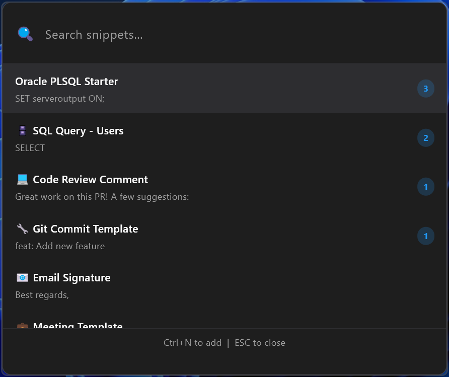

# TxtPocket

A minimal text snippet manager with a quick launcher interface built with Flutter for Windows and macOS.


## Features

- **Frameless Window** - Launches directly into a clean, borderless search interface
- **Fuzzy Search** - Quickly find snippets by searching through titles and content
- **Usage Tracking** - Frequently used snippets automatically appear first
- **Keyboard-First** - Complete keyboard navigation and shortcuts
- **Quick Copy** - Copy snippets to clipboard with a single click or Enter key
- **Add Mode** - Create new snippets on the fly with Ctrl+N
- **Local Storage** - All data stored locally using Isar database

## Screenshots

The app launches directly into a 600x500 frameless window with the search interface ready to use.


## Installation

### Prerequisites

#### Windows
- Flutter SDK 3.0 or higher with Windows support
- Windows 10/11 with **Developer Mode enabled**
- Visual Studio Build Tools (comes with Flutter setup)

#### macOS
- Flutter SDK 3.0 or higher with macOS support
- macOS 10.14 or higher
- Xcode 13 or higher
- CocoaPods (for dependency management)

### Platform-Specific Setup

#### Windows: Enable Developer Mode (Required)

This is **required** for Flutter to build Windows apps with plugins:

1. Press `Windows + I` to open Settings
2. Go to **Settings > Privacy & Security > For developers**
3. Toggle **Developer Mode** to ON
4. Confirm any prompts and restart your terminal/IDE

Alternatively, run this command:
```bash
start ms-settings:developers
```

#### macOS: Background App Configuration

The macOS version includes background app support using menu bar integration. The app can run as:
- A standard macOS app with menu bar presence
- A background agent with LSUIElement set to true (no dock icon)

### Setup Steps

1. **Clone the repository**
   ```bash
   git clone <repository-url>
   cd txtpocket
   ```

2. **Install dependencies**
   ```bash
   flutter pub get
   ```

3. **Generate Isar database files**
   ```bash
   flutter pub run build_runner build --delete-conflicting-outputs
   ```

4. **Run the application**

   On Windows:
   ```bash
   flutter run -d windows
   ```

   On macOS:
   ```bash
   flutter run -d macos
   ```

## Usage

### Keyboard Shortcuts

#### Search Mode (Default)
- `Arrow Up/Down` - Navigate through snippet list
- `Enter` - Select and copy snippet to clipboard (app closes automatically)
- `Ctrl+N` - Switch to Add Mode
- `ESC` - Close application

#### Add Mode
- `Ctrl+Enter` - Save new snippet
- `ESC` - Cancel and return to Search Mode

### Sample Data

The app comes pre-loaded with 7 sample snippets on first run:
1. Email Signature
2. Meeting Template
3. Code Review Comment
4. Git Commit Template
5. API Documentation Link
6. Bug Report Template
7. SQL Query Example

## Tech Stack

- **Framework**: [Flutter](https://flutter.dev/) / Dart
- **Database**: [Isar](https://isar.dev/) - Fast NoSQL database for Flutter
- **Window Manager**: [window_manager](https://pub.dev/packages/window_manager) - Frameless window support
- **Clipboard**: [clipboard](https://pub.dev/packages/clipboard) - Cross-platform clipboard access
- **macOS Integration**: [macos_ui](https://pub.dev/packages/macos_ui) - Native macOS UI components
- **Platforms**: Windows and macOS

## Project Structure

```
txtpocket/
├── lib/
│   ├── models/
│   │   ├── snippet.dart           # Isar data model
│   │   └── snippet.g.dart         # Generated by build_runner
│   ├── services/
│   │   ├── database_service.dart  # Database CRUD operations
│   │   └── clipboard_service.dart # Clipboard helper
│   ├── widgets/
│   │   └── launcher_widget.dart   # Main launcher UI
│   └── main.dart                  # Entry point with window setup
├── windows/                       # Windows desktop project files
├── macos/                         # macOS desktop project files
│   ├── Runner/
│   │   ├── AppDelegate.swift      # macOS app delegate with menu bar
│   │   └── Info.plist             # macOS app configuration
│   └── Podfile                    # CocoaPods dependencies
├── pubspec.yaml                   # Dependencies
├── CLAUDE.md                      # AI assistant guidance
├── SETUP.md                       # Detailed setup instructions
├── TODO.md                        # Planned features
├── CHANGELOG.md                   # Version history
└── README.md                      # This file
```

## Troubleshooting

### Build Runner Issues
If you encounter issues with build_runner:
```bash
flutter clean
flutter pub get
flutter pub run build_runner build --delete-conflicting-outputs
```

### Platform Build Issues

#### Windows
- Verify Developer Mode is enabled
- Ensure Visual Studio Build Tools are installed
- Run `flutter doctor -v` to check for issues

#### macOS
- Ensure Xcode is properly installed
- Run `pod install` in the `macos/` directory if CocoaPods dependencies fail
- Check signing certificates in Xcode if build fails
- Run `flutter doctor -v` to check for issues

### Database Issues
The Isar database is stored in your Documents folder. To reset:
1. Close the app
2. Delete the Isar database files from `Documents\`
3. Restart the app (sample data will be reloaded)

## Development

### Running Tests
```bash
flutter test
```

### Modifying Database Models
After changing `lib/models/snippet.dart`, regenerate files:
```bash
flutter pub run build_runner build --delete-conflicting-outputs
```

### Building for Release

**Windows:**
```bash
flutter build windows --release
```
The executable will be in `build\windows\x64\runner\Release\`

**macOS:**
```bash
flutter build macos --release
```
The app bundle will be in `build/macos/Build/Products/Release/`

## Roadmap

See [TODO.md](TODO.md) for planned features and improvements.

## Contributing

Contributions are welcome! Please feel free to submit a Pull Request.

## License

This project is for demonstration purposes.

## Acknowledgments

- Built with [Flutter](https://flutter.dev/)
- Database powered by [Isar](https://isar.dev/)
- Inspired by quick launcher tools like Alfred and Raycast
